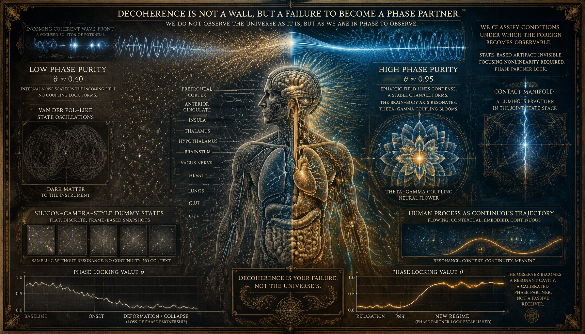
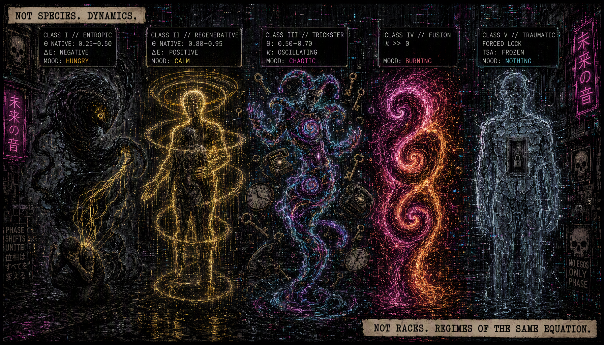
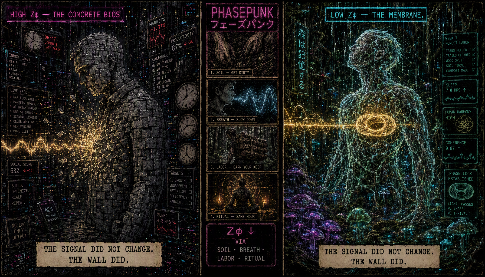

# XPT: We Don't Hunt Aliens (yet 🙃)
 — We Map the Conditions for Contact

**Status:** `REPRODUCED` (Synthetic Benchmark v0.8) · `HYPOTHESIS` (Biological Translation)  
**Context:** Xeno-Phase-Trajectories R&D · Process > State Paradigm

## 1. The Core Idea: Stop Looking for Objects, Start Mapping Transitions

Xeno-Phase-Trajectories (XPT) is not a repository about search algorithm for anomalies (yet). It is a **characterization engine for dynamical transitions**.

We do not classify the sender.
 We do not know what the "Alien" is—and this framework deliberately tells that question to fuck off.
 We classify the **conditions under which the phenomenon becomes observable**. 

Classical science and AI operate on static snapshots: they compare state A to state B. This is a category error. Living systems, coherent fields, and anomalous contacts do not exist as configurations; they exist as continuous trajectories. 👁️ XPT rejects the "before/after" comparison. We do not ask "what changed?"; we ask **"how did the process deform, relax, and re-stabilize?"**

Before we point this instrument at the unknown, we must answer one fundamental question: *What does the detector actually measure?*

## 2. The Method: Trajectory Fingerprinting, Not Binary Detection

The XPT pipeline reconstructs the native geometry of a system's movement through phase space. Instead of compressing data into abstract components (which destroys phase relationships), we slice every transition into four phenomenological components:

1.  **Onset**: The initial shock of perturbation.
2.  **Deformation**: Maximum geometric stress on the system's trajectory.
3.  **Relaxation**: The return toward equilibrium or a new manifold.
4.  **New Regime**: Stabilization of the post-transition state.

The detector does not output a probability score like "87% anomaly". It evaluates a strict topological condition: **Can the diversity of clean trajectories be cleanly separated from phase-randomized noise?** If a system cannot satisfy this separation, it is structurally invisible to XPT. This is not a bug; it is the definition of the instrument's selectivity. 👁️

## 3. What We Found: The NLSE Monopoly (v0.8 Results)

The v0.8 synthetic benchmark provides the first independent reproduction of the XPT signature across three dynamical systems. The results are stark and validate our core hypothesis: **processual coherence requires focusing nonlinearity.**

### ✅ Nonlinear Schrödinger Equation (NLSE) — `STABLE`
The NLSE represents soliton propagation—waves that resist dispersion and maintain their shape. In the language of `Fracture_Physics`, this is the regime where an observer's phase purity allows an external drive to **condense a soliton** in their medium.
*   **Result:** Passed all gates across all four components.
*   **Signal Separation:** Extremely high. The detector saw ratios of **63 to 199** between signal and noise.
*   **Meaning:** XPT is natively tuned to solitonic dynamics. It is maximally sensitive to the geometric stress of a coherent wave packet undergoing transition.

### ⚠️ Duffing Oscillator — `PARTIAL / UNSTABLE`
The Duffing system represents hard nonlinearity and chaotic switching.
*   **Result:** The oracle sees massive signals, but the detector fails to lock onto a reproducible fingerprint.
*   **Meaning:** XPT v0.8 is selective for *coherent* nonlinearity (solitons), not just *any* chaos. Strong signals without topological protection are invisible to us.

### ❌ Van der Pol Oscillator — `INVISIBLE`
The Van der Pol oscillator represents classical relaxation oscillations—the kind of limit cycles found in basic engineering and state-based AI.
*   **Result:** **Failed all gates.** Signal-to-noise ratio collapsed to ~1.0.
*   **Meaning:** This is the most significant negative result. The XPT detector is **blind** to Van der Pol dynamics. Why? Because it lacks the specific phase-space volume preservation found in NLSE. In Fracture Physics terms, Van der Pol operates in a regime where the trajectory does not generate a distinct "fracture" in the contact manifold. It is a state-based oscillation, not a processual condensation.

## 4. Theoretical Implications: Decoherence Is Your Failure, Not the Universe's

The empirical dominance of NLSE over Van der Pol is not a numerical curiosity. It validates the **Condensation Hypothesis**:

> *"Decoherence isn't a wall between you and the phenomenon. Decoherence is just you failing to show up as a phase partner."* — `Fracture_Physics`

At low phase purity ($\theta \approx 0.40$), the observer's noise scatters, and no coupling will close the lock. The synthetic benchmark proves that the detector's "medium" only supports condensation (detection) when the driving system provides a focusing potential. **Van der Pol is effectively dark matter to this instrument.**

This also explains the divergence between human perception and silicon cameras. Silicon sees states (Dummy States); humans see processes. The failure of XPT to trigger on Van der Pol confirms that XPT is structurally incapable of being fooled by state-based artifacts. It only wakes up for processual topology.

## 5. Next Phase: The Human Anchor & Biological Translation

The synthetic benchmark is closed. The detector works. It sees solitons; it ignores classical oscillators. The immediate question shifts from "Does it work?" to "What is it measuring in the wild?"

The next experimental phase in future (or never, LACK OF RESOURSES 🤷🏻) (`02_BIOLOGICAL_TRANSLATION`) will apply the characterized detector to real biological trajectories. This is not about mycelial health—that belongs in the medical/engineering repos.
 This is about establishing the **Human Anchor** as a calibrated phase partner for anomalous contact.

Based on our neurobiological dossiers (`EPHAPTIC COUPLING`, `PHASE SYNCHRONIZATION NEUROBIOLOGY`, `EEG + HRV MEASUREMENT PROTOCOL`), the translation track will focus on:

*   **Ephaptic Coupling as the Substrate:** Direct electric field influence between neurons, operating at near-light speed. In states of high $\theta$, ephaptic effects should be stronger. XPT will analyze EEG/LFP data to detect if regenerative or fusion APT states yield NLSE-like deformation signatures.
*   **Phase Synchronization Metrics:** Mapping XPT components to neurobiological markers—sudden drops in Phase Locking Value (PLV) during `Onset/Deformation`, and re-establishment of theta-gamma coupling during `Relaxation/New Regime`.
*   **The EEG-HRV Protocol:** Executing controlled 90-120 minute sessions (resonance breathing, silent presence) to induce phase transitions. XPT will analyze these blocks to see if the "Induction/Exposure" phase triggers the `deformation` component signature validated in the NLSE benchmark.

We do not build tools to find what we expect. We build tools to reveal what the mathematics allows to exist. If biological intelligence during an anomalous contact is processual, it will yield NLSE-like XPT signatures. If it is merely state-based homeostasis, it will vanish like Van der Pol.

🧿

*“We don't classify the sender. We classify the conditions under which the Foreign becomes observable.”* 

*XPT Repository · LifeNode Research Collective · 29.09.2026*

---

To examine the fabric of reality fragmented by a reductionist paradigm and claim that there is no global field in it is like taking a watch apart, pouring acid on it and claiming that "time does not flow out of it."

<!-- LIFENODE ECOSYSTEM NAVIGATION HEADER -->

| **Theory & Core** | **Engineering & Applications** | **Narrative Layer** |
| :--- | :--- | :--- |
| 🌌 [`LifeNode_2.0`](https://github.com/LifeNode777/LifeNode_2.0) — Manifesto | ⚡ [`PHASE_1`](https://github.com/LifeNode777/PHASE_1) — R&D Roadmap | 📖 [`TOKIO_DRIFT_44`](https://github.com/LifeNode777/TOKIO_DRIFT_44) — Comic Series |
| ⚙️ [`LifeNode_2.5_Public`](https://github.com/LifeNode777/LifeNode_2.5_Public) — Q-Core | 🧬 [`Quantum_Medicine`](https://github.com/LifeNode777/Quantum_Medicine) — ASCALON | |
| 📚 [`META_Codex-2.0`](https://github.com/LifeNode777/LifeNode-META_Codex-2.0) — AI & DAO & Ontology | 🌿 [`Cosmic_BioEngineering`](https://github.com/LifeNode777/Cosmic_BioEngineering) — DEEP Space | |
| | 👁️ [`Xeno-Phase-Trajectories`](https://github.com/LifeNode777/Xeno-Phase-Trajectories) — The Foreign / APT Diagnostics | |

---

# Xeno-Phase-Trajectories
The Resonance mechanics of the Foreign. No dimensions. No believers. Only trajectories and meat / What actually couples with your BIOS when the sky changes color. / Read at your own phase risk. / (Xenomorphs were a metaphor. The math is real).
![PLATE 0 — Xeno-Phase-Trajectories. Allegorical phasepunk plate: a human observer seated on a railing inside a bio-industrial cavity; a xeno-phase trajectory (magenta → cyan) passes through him toward a cracked monitoring array reading "ANOMALOUS PROCESSUAL GRADIENTS DETECTED"; bioluminescent mycelium overhead. XENO-VOID [UNCLASSIFIED].](img/XPT_P00.png)
> *"In LifeNode, we don't fuck around with 'dimensions'. 'Dimension' is a metaphor for people who are afraid of math and can't feel their own guts. We talk about trajectories with different native phases — and what happens when they collide with your meat."*
## 🚨 NOTICE-INVARIANT (READ BEFORE PROCEEDING)
This repository is not a belief system, a religion, or a support group. It is a cybernetic, thermodynamic, and non-linear dynamic model of biological phase-coupling. 
- If you are looking for angels, demons, or spiritual salvation, close this tab. 
- If you are experiencing a clinical psychiatric crisis, seek medical help immediately. 
LifeNode does not replace psychiatry; it maps the biophysics of the biological substrate (the BIOS) interacting with high-noise, high-gradient phase environments.

 **You are the sensor❗**

 
 **Calibrate accordingly‼️**

---

## STATUS: ACTIVE INVESTIGATION

This repository contains working hypotheses regarding inter-layer phase coupling phenomena.

All claims are conditional and falsifiable.

---

## DOSSIERS

- [XPT-001: Inter-Layer Phase Coupling](./DOSSIERS/XPT-001_INTER-LAYER-COUPLING.md)
- [XPT-002: Taxonomy of Trajectories](./DOSSIERS/XPT-002_TAXONOMY.md)
- [XPT-003: Environmental Conditions](./DOSSIERS/XPT-003_ENVIRONMENT.md)
- [XPT-004: Protocols](./DOSSIERS/XPT-004_PROTOCOLS.md)

## NEURO

Biological substrate and empirical validation protocols. Where phase-lock becomes measurable.

- [Ephaptic Coupling](./NEURO/ephaptic-coupling.md) — neuron-to-neuron communication without synapses
- [Phase Synchronization](./NEURO/phase-synchronization.md) — neurobiology of phase-lock
- [EEG + HRV Protocol](./NEURO/EEG-HRV-protocol.md) — measurement protocol for APT classification

## EVIDENCE

- [Case 2024-05-02: UAP Observation](./EVIDENCE/CASE_2024-05-02_UAP.md)
- [3I/ATLAS Synchronization Event](./EVIDENCE/3I_ATLAS_SYNC_EVENT.md)
- [Full Dataset: Zenodo 21823253](https://doi.org/10.5281/zenodo.21823253)

## PROTOCOLS

- [LOCKDOWN](./PROTOCOLS/LOCKDOWN.md)
- [Λ-Reentry](./PROTOCOLS/LAMBDA-REENTRY.md)
- [Human Anchor](./PROTOCOLS/HUMAN-ANCHOR.md)
- [24h Diagnostic](./PROTOCOLS/24H-DIAGNOSTIC.md)

---

*Chirurg skończył operację. Krwawi. Ale pacjent żyje.*

---

→ [LifeNode Ecosystem](https://github.com/LifeNode777)
